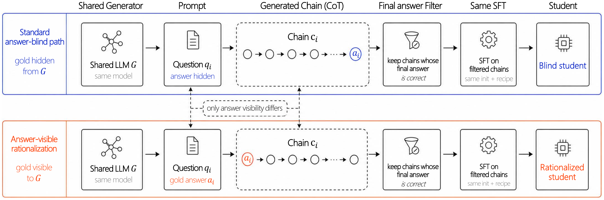

<div align="center">

# 💧 Answer Leakage

### The One-Bit Experiment

<em>Answer-Conditioned Chains of Thought Degrade Verifiable-Reasoning Distillation in Large Language Models</em>

[](https://arxiv.org/abs/2607.14552)
[](LICENSE)
[](#citation)
[](https://www.python.org/)
[](https://github.com/js-lee-AI/answer-leakage/stargazers)



<em>One generator, the same problems, the same correctness filter, the same SFT recipe. The arms differ by one bit: whether the gold answer was visible when the chain was written.</em>

<b><a href="#citation">📄 Paper</a> · <a href="#overview">✨ Overview</a> · <a href="#install">⚙️ Install</a> · <a href="#reproduce-the-one-bit-experiment">🚀 Reproduce</a> · <a href="#screen-a-teacher-before-training-it">🔍 Screen a teacher</a> · <a href="#results">📊 Results</a> · <a href="#citation">📌 Citation</a></b>

</div>

---

## News

- **2026-07** · Paper posted to arXiv at [2607.14552](https://arxiv.org/abs/2607.14552), and the method code is public here.

## Overview

A standard recipe for distilling reasoning is to sample chains of thought from a model, keep the ones that reach the correct final answer, and fine-tune on the survivors. When sampling fails, a common fix is to show the generator the gold answer and ask it to write a chain that reaches it. STaR-style rationalization and answer-aware refinement pipelines both do this.

We show that the fix degrades the training data in a way the correctness filter cannot catch, because the chain is correct by construction. The damaged chains pass every check and still teach the wrong behavior.

The **one-bit experiment** isolates the cost. Fix the generator, the problem set, the correctness filter, the data volume, and the recipe. Vary one bit: whether generation is answer-conditioned.

1. From one generator, produce chains for the same 935 problems twice, once answer-blind and once with the gold answer shown together with a request to reach it.
2. Keep only chains whose final answer is correct, in **both** arms.
3. Fine-tune two students under one identical recipe.
4. Read the leakage penalty, `acc(blind) - acc(leaked)`.

Three findings come out of it:

* **The harm is in the data, not the generator.** It transfers when one model's chains train a different model, and across teacher families.
* **The mechanism is legible.** Answer-conditioned chains rationalize backward from the shown answer instead of deriving it. The measurable symptom is stating the answer early, the **answer-first rate (AFR)**. Within one corpus, the chains that do this carry most of the harm.
* **You can screen a teacher before training it.** `dAFR = AFR_leaked - AFR_blind`, read off unlabeled generations with no fine-tuning, orders the penalty across eight models from four families at `r = 0.960`.

The practical takeaway is to generate answer-blind. It costs nothing extra and no correctness filter can see this damage in the data.

## Install

```bash
pip install -r requirements.txt
```

`math_verify` is pinned to an exact version on purpose. It decides which chains pass the keep-correct filter and which evaluation answers score as correct, so a different version silently changes which chains enter the training corpora. Do not relax that pin.

Gated checkpoints (Qwen, for example) need `huggingface-cli login`.

The paper's runs use 3x A100-80GB for the 8B full-parameter SFT and vLLM for generation and evaluation.

## Reproduce the one-bit experiment

Everything below runs from the repo root. Nothing is bundled: the chains are regenerated by step 1.

### 0. Problems

`src/generate_chains.py` reads a jsonl of problems, one object per line:

```json
{"uid": "p001", "domain": "math",
 "messages": [{"role": "user", "content": "<problem text>"},
              {"role": "assistant", "content": "... \\boxed{<gold answer>}"}]}
```

The gold answer is read from the last `\boxed{}` of `messages[1]`. The paper draws its problems from the math split of [Nemotron-Cascade-SFT-Stage-2](https://huggingface.co/datasets/nvidia/Nemotron-Cascade-SFT-Stage-2), disjoint from every evaluation set.

### 1. Generate both arms (the one bit)

```bash
python src/generate_chains.py --model Qwen/Qwen3-8B --condition both \
    --src data/problems/math.jsonl --output_dir data/g1 \
    --n_problems 2000 --n_samples 2
```

`--condition nohint` is the answer-blind arm and `--condition hint` is the answer-leaked arm; `both` runs the pair. Add `--dry_run` to print the rendered prompts for two problems without a GPU. The SFT input is the bare question in every arm, so the arms differ only in how the chain was written.

The three answer-visible ablation arms (`derivefirst`, `ignore`, `finalcheck`) hold visibility fixed and vary only the instruction. They are what localizes the harm to the instruction rather than to the answer being visible.

### 2. Match the arms

```bash
python src/build_matched.py --dir data/g1
```

Intersects the uids kept by both arms, so both end up on the same problems (935 in the paper), and prints `dAFR` immediately. No training needed for that number.

### 3. Train the two students

One recipe, both arms. Only `--data_path` changes.

```bash
for arm in nohint hint; do
  deepspeed --num_gpus 3 src/train_sft.py \
      --experiment ${arm}_s42 --data_path data/g1/${arm}_matched.jsonl \
      --base_model Qwen/Qwen3-8B --ds_config configs/ds_zero3.json \
      --max_seq_length 10240 --batch_size 1 --gradient_accumulation 16 \
      --epochs 1 --learning_rate 2e-5 --seed 42
done
```

Effective batch size is `batch_size * gradient_accumulation * NUM_GPUS = 48`. On a different GPU count set `--gradient_accumulation` to `48 // NUM_GPUS` to keep it at 48. The paper reports seeds 42, 123 and 7777. ZeRO-3 is not optional here: ZeRO-2 diverges on Qwen3 under this configuration.

### 4. Evaluate and read the penalty

```bash
for arm in nohint hint; do
  python src/evaluate_math500_vllm.py --experiment ${arm}_s42 \
      --merged_model_path outputs/${arm}_s42/checkpoint-20 \
      --base_model Qwen/Qwen3-8B --tensor_parallel 2 --output_dir eval_results
done
```

The checkpoint number is the step count of the single epoch: 935 examples at an effective batch of 48 gives 20 optimizer steps, so `checkpoint-20`. Check `ls outputs/${arm}_s42/` if your corpus size differs.

The penalty is `accuracy(nohint) - accuracy(hint)`. Evaluation runs in thinking mode at temperature 0.6, top-p 0.95, top-k 20, with a 32,768-token budget. Greedy decoding is not a valid substitute for a thinking model and will not reproduce these numbers.

## Screen a teacher before training it

The penalty costs two fine-tunes to measure. `dAFR` costs a generation pass and predicts it. To screen one candidate teacher:

```bash
python src/generate_chains.py --model <candidate> --condition both \
    --src data/problems/math.jsonl --output_dir data/screen_<candidate>
python src/build_matched.py --dir data/screen_<candidate>
```

The second command prints, before any training:

```
AFR  blind(nohint)=26.6% (n=918)  leaked(hint)=47.4% (n=924)  signature dAFR=+20.8
```

Read `dAFR` against the fit: about +20 points of signature went with about 16 points of penalty on Qwen3-8B, and a signature near zero (DeepSeek-R1-Distill-Llama-8B, `dAFR = -0.2`) went with no penalty. Higher `dAFR` means the model takes the rationalization shortcut when it can see the answer, so its answer-conditioned chains are worse training data.

Some models need a system message to emit a think block at all. Llama-Nemotron needs `--system "detailed thinking on"`.

## Results

Qwen3-8B, MATH-500, three-seed means. The base model scores 95.2 under this harness.

| Setting | Blind | Leaked | Penalty |
|---|---|---|---|
| **MATH-500** | **95.1** | **78.9** | **16.2** |
| GSM8K (grade school) | 95.4 | 90.5 | 4.9 |
| Minerva (graduate STEM) | 48.7 | 38.5 | 10.2 |
| AIME 2024-2025 (olympiad) | 71.7 | 44.4 | 27.2 |
| MBPP+ (code, pass rate) | 68.3 | 58.8 | 9.5 |
| GPQA-Diamond (multiple choice) | 37.6 | 40.2 | none |

The blind student sits at the base model within seed noise (95.1 against 95.2), so answer-blind self-distillation is free and essentially the whole gap is leakage damage. The penalty grows with difficulty, from 0.0 at MATH-500 Level 1 to 21.4 at Level 4 and 27.2 on AIME. It vanishes on multiple-choice benchmarks, which select an option instead of deriving an answer, the boundary the mechanism predicts.

Controls and mechanism:

| | Result |
|---|---|
| Length-matched blind arm | 95.0, so the penalty is content, not length |
| Carrier split, difference-in-differences | +16.9 (three-seed mean) |
| Excising the single answer-stating line | recovers 24.6 of 29.8 points, 83% of the gap |
| Derive-first instruction at fixed visibility | penalty falls 16.2 to 4.3 |
| Signature against penalty, eight models, four families | r = 0.960, leave-one-family-out MAE 2.9 |

Where a pipeline cannot avoid showing the gold answer, a derive-first instruction recovers about two-thirds of the penalty while keeping every example. Generating answer-blind avoids it outright.

## Repository layout

```
src/generate_chains.py        the one-bit intervention: the five generation prompts
src/answer_match.py           symbolic answer checker (the keep-correct filter) + AFR
src/build_matched.py          matched-pair construction; prints dAFR before training
src/train_sft.py              full-parameter SFT, the one recipe used by every arm
src/evaluate_math500_vllm.py  MATH-500 evaluation harness
configs/ds_zero3.json         DeepSpeed ZeRO-3 config
```

This is the main experiment only. The controls, the code-domain arm and the cross-model fit reported in the paper are built from the same five files and are not shipped as separate scripts.

## Notes

**Two answer matchers, on purpose.** `src/answer_match.py:answers_match` is the generation-side keep-correct filter. `src/evaluate_math500_vllm.py:answers_match` is a slightly stricter variant that scores benchmark answers, and it is what produced every accuracy in the paper. They agree on about 99.6% of MATH-500 answers; the evaluator asks `math_verify` first and returns its verdict, while the filter falls through to a numeric fallback that strips non-digit characters and so accepts a few pairs the evaluator rejects. Do not unify them without re-running every evaluation.

## Citation

```bibtex
@article{lee2026answerleakage,
  title   = {Answer-Conditioned Chains of Thought Degrade Verifiable-Reasoning
             Distillation in Large Language Models},
  author  = {Lee, Jungseob and Lee, Seungyoon and Son, Suhyune and
             Lee, Dongyub Jude and Han, Sungbin and Eo, Sugyeong and Lim, Heuiseok},
  journal = {arXiv preprint arXiv:2607.14552},
  eprint  = {2607.14552},
  archivePrefix = {arXiv},
  primaryClass  = {cs.CL},
  year    = {2026}
}
```

## License

Released under the [MIT License](LICENSE). The paper is distributed under CC BY 4.0 via arXiv.
